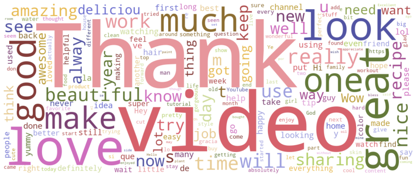
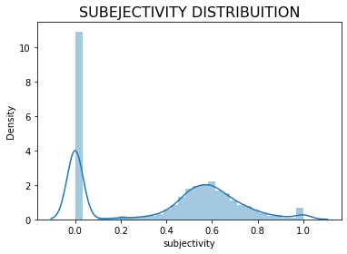

# YouTorial

## Goal
YouTube's own recommendation engine relies on a variety of factors, some metrics visible to users (likes, views, etc.), and some (personalized results, promoted/sponsored videos, viral hits, etc.) that affect the videos recommended to users. In particular, searches for 'how-to' and tutorial videos tend to return results of varying quality and relevance. Our goal for this project is build our own recommendation algorithm that uses sentiment analysis of comments, likes, views, video lengths, objectivity scores, and other key metrics. 

## Methodology

### Workflow 

### API Requests

The first component of this project entailed scraping YouTube's V3 API. Specifically, we utilized YouTube's API explorer as a starting point for our own scripts to acquire desired video data: metrics and comments. To do this, we needed to start with a search result. A search result contains information about a YouTube video, channel, or playlist that matches the search parameters specified in an API request. While a search result points to a uniquely identifiable resource, like a video, it does not have its own persistent data. Thus, after this, we turned to the video’s endpoint to gather the necessary, aforementioned data. The search results were specified so we query only "How To" category videos on Youtube throughout the 5 U.S. regions as specified by regional parameters. One script was designed to do these search queries, obtaining video IDs, titles, and channel information.  This data was then uploaded to a table in our database hosted on the Google Cloud Platform.  Next, we queried this table for uniqe video IDs using another script. This script would take the unique ID then query YouTube's API again for features including video title, video length, number of views, number of likes, number of comments, and the comments themselves. These were uploaded to two seperate tables in our database, one for comments and one for metrics.  Finally, one script was used to query this information to consrutct the ratios of likes to views and comments to views. Additionally,  using sentiment analysis, videos were given scores for their comments' subjectivity and polarity.  Using these metrics, a Principle Components Analysis was done to rank our videos based on a particular query.  The top six videos based on this ranking were selcted to be displayed on our GUI.

### Database Management

Our workflow for database management was as follows. Once we scraped YouTube's API, we honed in on unique video ID's to populate one table with the Video ID, Video Title, and Channel ID. Using a python script, we queried a distinct list of Video ID's and fed the list into the aforementioned function which extracted metrics and comments. This process was implemented for tens of thousands of videos. The main task for this team was to iteratvely populate our database while organizing the data structures. Furthermore, diagnostic SQL views were written which selected all unique video IDs in the video ID table and included a "WHERE" statement which selected only video IDs which were not in the metrics table, which allowed for quick counts of video ids without metrics or comments.  A similar "WHERE" clause was use for selecting video ids to analyze where the video ID did not appear in the analytics table. Because of the volume of date analyzed making sure that videos were not double counted ensured the  efficacy of the data analysis pipeline to the final table. This view doubled as a count of videos with metrics and comments yet to be analyzed.

### GUI 
To build our web app that shows user the top six recommended tutorials based on our sentiment analysis and ranking algorithm (summarized by PCA), we used Streamlit, a free online Python-based tool. We first used SQLAlchemy to connect to our GCP-hosted database and query the top six video ID's based on the user's search entry. We then pasted these id's with the base YouTube url to create a list of links to the recommended videos. From there, we used an extraneous package called streamlit_player to directly loop through this list and embed the selected videos onto our web app. After some creative layout-wrangling, we deployed the web app using Streamlit through our Github repository for public use. 

### Analysis and Findings

 After the performance metrics were collected and joined to the videoIDs, comments and likes were scaled based on the number of views the video had. If a tutorial is helpful it is likely to garner a response from the user in the form of a like or comment. However, if a video has a lot of views then it may have a disproportional amount of engagement simply because it has been viewed more times. Making the comment and like counts proportional to the views allowed us to scale videos which may not have been elevated by the YouTube’s algorithm, but are helpful for the users who found those videos anyway. These metrics capture the proportion of people who were moved to express themselves from watching the tutorial video.  
 For comments, higher engagement can swing in both positive and negative directions. A video could have many comments, but be panning the methods demonstrated. To delineate between positive and negative comment engagement, we employed two different measures of text analysis. The first score was polarity, which takes all the text from the comments, cleans them of stop words and quantifies the positive vs negative words overall. The score is measured on a scale from -1 to 1, where scores closer to -1 are more negative in  overall tone and scores close to 1 are more positive in overall tone. This gives insight into the quality of the engagement a video is garnering, which should indicate the quality of the information content.  
 The second score was subjectivity, which looks at the words which are more opinionated and measures them against words that are objective. The score is on a scale of 0 to 1, where scores closer to 0 are more objective and scores closer to 1 are more opinionated. This score is less clear cut as some tutorial’s quality could be measured by how much someone liked the final product, which is an opinion, while other tutorial’s quality could be measured with how well it fixed an issue or solved a problem which is more of an objective rating. Which rating in subjectivity is more important is contingent on the content on which the tutorial informs. For example, a cooking tutorial more subjective comments might be better for gauging the quality because a persons thoughts about foods and taste are opinion. Conversely a tutorial on changing a car's oil would be better served with more objective comments, as there are objectively correct and incorrect ways of performing this maintenance.  
 After exmining the distribution of the Polarity scores, we concluded that the vast majority of comments on "How to" videos were positive. Despite the somewhat dismal reputation of the YouTube Comments Section, we were happy to find that videos about sharing information and teaching others were met with supprt and positvity in the comments. With this context, our following examiniation of the subjectivity scores lead us to to the conclusion more subjective comments were generally ones that used more flowery and subjective language. Words like "impressive" and "awesome" were very prevalent amongst comments with high subjectivity scores. This understanding that all of our metrics of analysis tended to vary positively with our unmeasurable outcome of interest, the "Usefulness" or "Likeabability" of a video, lead us to the use of Principle Components Analysis for dimensionality reduction. Because of the nature of PCA, we believe it to be a very appropriate and concise method of compressing and summarizing the statistics and ratios we computed into a "Likeability/Usefulness Score" that we could then rank by to give video recommendations.

   

## Instructions for reproduction

 1) Go to Google Cloud Platform, login, go to APIs & Services/Enable APIs, enable YouTube Data API V3, then create a new API key.  Paste this to scraping/file_dependencies/demo_api_keys.json. 

2) While in GCP, go to SQL, create a new instance, go to Databases, and create a new database. Your credentials will be on this page.  Use these to populate the .env file.

3) In DBeaver (or your SQL editor of choice), run, in order, the scripts in database/tables_and_views.  This will set up the infrustructure for the database.

4) Navigate to the scraping folder then open 1_search_results.py.  Go below the `if __name__ == "__main__":` block and specify the query you'd like to run.  Run this script.  This will populate the database with video IDs, title names, and channels associated with your query.

5) While still in the scraping folder, open 2_loop.py and run this to get the metrics and comments for the videos you obtained in Step 4.

6) Navigate to the analysis folder.  Run 3_get_analytics.py. This grabs the videos' metrics and comments from our database, does the sentiment anaylysis on the comments, calculates ratios, and then sends them back to the database.

7) Finally, in your terminal, type: python -m streamlit run gui/4_streamer.py.  This will pull up the final product.

8) Do a search for a *YouTorial* of your choice! :)

***This process is made to set up the infrustructure of this project.  Following these steps will only populate your tables with 250 videos.  You can scale this up as you see fit by changing the values in the `if __name__ == "__main__":` blocks of 1_search_results.py and 2_loop.py.  Also note that YouTube Data API V3 only allows 10,000 queries in a day.  You will need to wait until this resets to keep populating your database.***

## Conclusion
 By providing user-agnostic, unsponsored, and unpromoted results based solely on a metrics-based ranking system, YouTorial fulfills a ubiquitous market need for the recommendation of high quality tutorial videos. During our preliminary research, we realized the full extent of how the concept of virality has degraded the information landscape - many top results were short-format 'hack' videos, viral hits, or generally unhelpful results. In the context of tutorial videos, users need to quickly find high quality, instructive, and vetted tutorials, which YouTube currently fails in providing. In building our final product, one of the main takeaways we learned was how reliant YouTube's recommendation engine is on user-specific data that is tracked by Google. Our recommendation algorithm relies strictly on analyzing metrics and comments pulled from videos themselves - this does provide an unbiased and standardized recommendation, however, it also limits the strength and complexity of our ranking system. In addition, numerous limits on API keys, GCP storage, and search result querying curtailed how large we could build our database, thus impacting the quality and quantity of recommended videos returned for a user's query. Ultimately, our final product relies predominantly on the tonal analysis of comments to rank and recommend the best videos for users, providing an objective solution to a subjective problem. 
 
## Future Work 
While we have a fully operational algorithm to recommend the right videos based on a user's search, our final product suffers from a lack of data. Due to query constraints in scraping videos using the YouTube API, we were limited to how large of a database we can feasibly build within the timeframe of this project. In the future, building out a library of API keys through GCP would allow us to automatically populate our database to provide better recommendations to users. In addition, access to dislike metrics and the ability to perform word association analysis would vastly improve our algorithm. 
